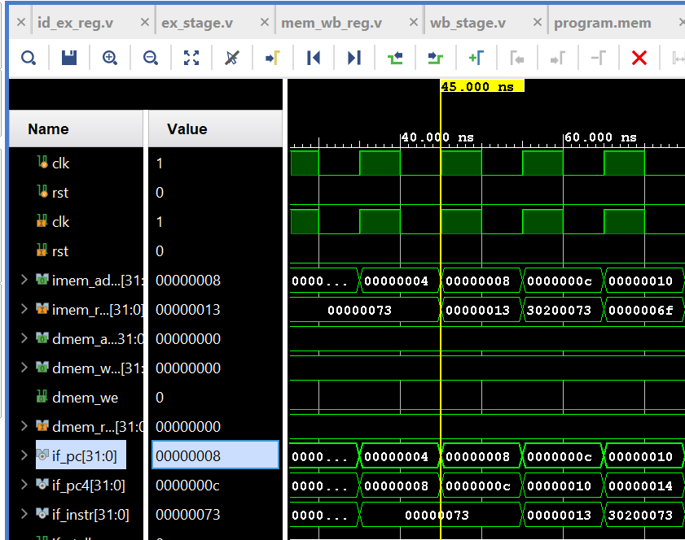

# RV32I 5-Stage Pipelined RISC-V Core

A fully functional **RV32I RISC-V processor** implemented in Verilog with a classic **5-stage pipeline**, including hazard handling, forwarding, and CSR support.

---

## ✨ Features

- RV32I base integer instruction set
- 5-stage pipeline (IF, ID, EX, MEM, WB)
- Hazard detection and pipeline stalling
- Data forwarding (EX/MEM and MEM/WB)
- Control hazard handling with flush
- CSR support (mtvec, mepc)
- ECALL and MRET implemented
- Separate instruction and data memories
- Clean simulation (no X/Z states)

---

## 🧠 Pipeline Stages

1. **IF** – Instruction Fetch
2. **ID** – Instruction Decode & Register Read
3. **EX** – Execute / ALU / Branch
4. **MEM** – Data Memory Access
5. **WB** – Write Back

---

## ⚙️ CSR Support

- `mtvec` – Trap vector base
- `mepc` – Exception program counter
- `ECALL` – Trap entry
- `MRET` – Trap return

---

## 🧪 Simulation

- Simulator: Vivado XSIM
- All internal signals verified
- Clean green waveforms (no X/Z)
## 🧪 Simulation Waveforms

---

## 📂 Directory Structure

See repository tree for RTL, testbench, and memory layout.

---

## 🚀 Future Work

- Full CSR instruction support (CSRRW/CSRRS)
- Interrupt controller
- AXI/Wishbone interface
- RV64 extension

---
## ▶️ How to Run Simulation

1. Open Vivado
2. Create a new RTL project
3. Add files from `rtl/`, `memory/`, and `tb/`
4. Set `tb_soc.v` as top module
5. Run behavioral simulation

## 👨‍💻 Author

**Aryan Ravindra Shinde**  
Diploma Engineer | RISC-V | VLSI | RTL Design

---

## 📜 License

MIT License
